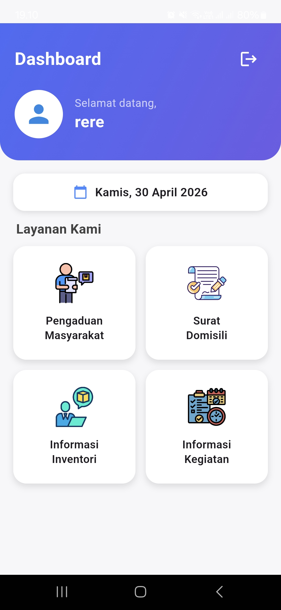
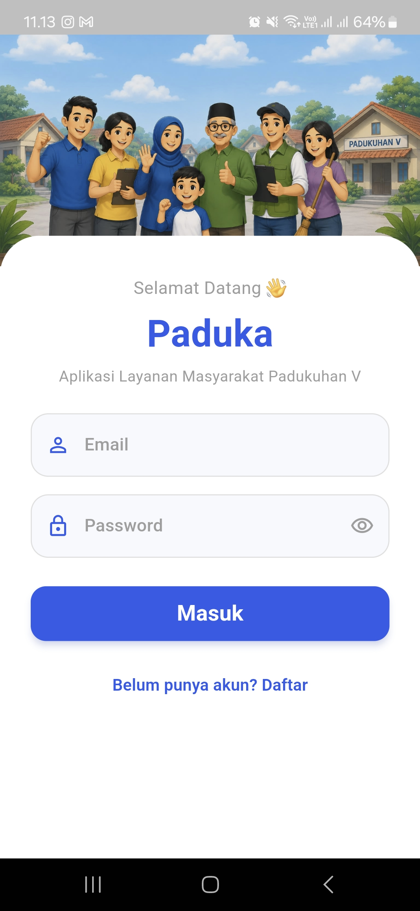
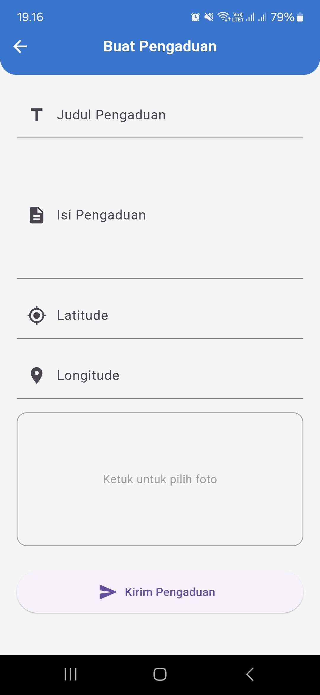
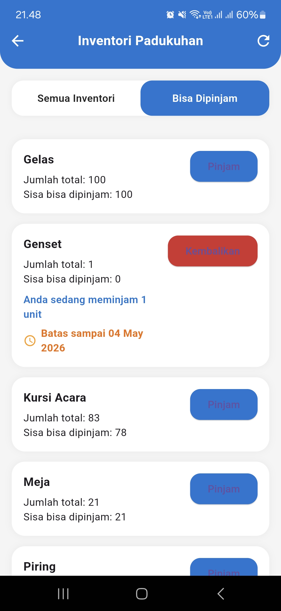
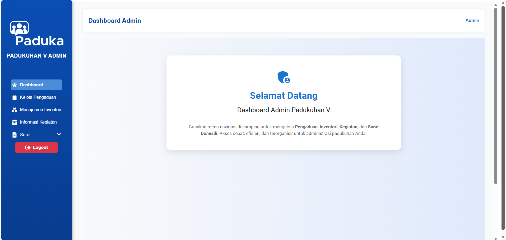
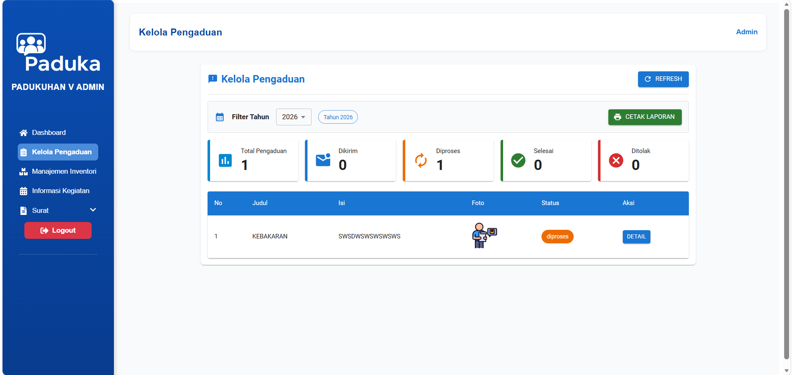
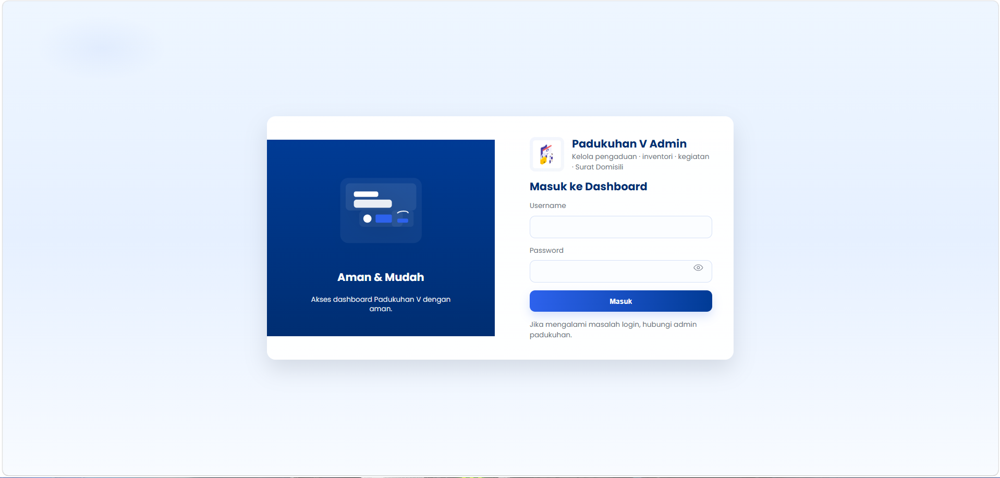

# 🏘️ Smart Village

**Smart Village** adalah sistem informasi dan layanan masyarakat berbasis digital yang dikembangkan untuk mendukung penyampaian informasi serta pelayanan administrasi di tingkat padukuhan.

Sistem ini terdiri dari tiga bagian utama:

- 📱 **Mobile Application** — Flutter untuk masyarakat
- ⚙️ **Backend API** — Node.js & Express.js
- 🖥️ **Admin Dashboard** — React.js untuk pengelola

---

## 📱 Mobile Application

Aplikasi mobile dikembangkan menggunakan **Flutter & Dart** sebagai platform utama untuk masyarakat.

Melalui aplikasi ini, masyarakat dapat mengakses informasi dan menggunakan berbagai layanan secara langsung melalui perangkat mobile.

### Fitur Utama

- 🔐 Registrasi dan login pengguna
- 🏠 Beranda informasi padukuhan
- 📢 Informasi kegiatan
- 📦 Informasi dan inventori
- 📝 Pengajuan pengaduan
- 📋 Riwayat pengaduan
- 📄 Pengajuan surat domisili
- 📋 Riwayat pengajuan surat
- 🔔 Notifikasi menggunakan Firebase Cloud Messaging (FCM)

### Screenshots

| Beranda | Login |
|---|---|
|  |  |

| Pengaduan | Inventori |
|---|---|
|  |  |

---

## 🖥️ Admin Dashboard

Admin Dashboard dikembangkan menggunakan **React.js** untuk membantu pengelola dalam mengelola informasi, layanan, serta data yang digunakan oleh masyarakat.

### Fitur Utama

- 🔐 Login administrator
- 📊 Dashboard informasi
- 📢 Pengelolaan pengaduan masyarakat
- 📦 Pengelolaan inventori
- 📅 Pengelolaan kegiatan
- 📄 Pengelolaan layanan administrasi
- 👥 Pengelolaan data pengguna
- 🔄 Integrasi dengan Backend API

### Screenshots

| Dashboard | Pengaduan |
|---|---|
|  |  |

| Login |
|---|
|  |

---

## ⚙️ Backend API

Backend berfungsi sebagai **REST API** yang menghubungkan aplikasi Flutter dan Admin Dashboard dengan database.

Backend menangani proses autentikasi, pengelolaan data, layanan administrasi, pengaduan, inventori, kegiatan, serta komunikasi antara client dan database.

### Teknologi

- **Node.js**
- **Express.js**
- **REST API**
- **Sequelize**
- **Database**
- **Firebase**

### Struktur Backend

```text
Backend/
├── config/
├── controllers/
├── cron/
├── middleware/
├── migrations/
├── models/
├── routes/
├── app.js
└── package.json